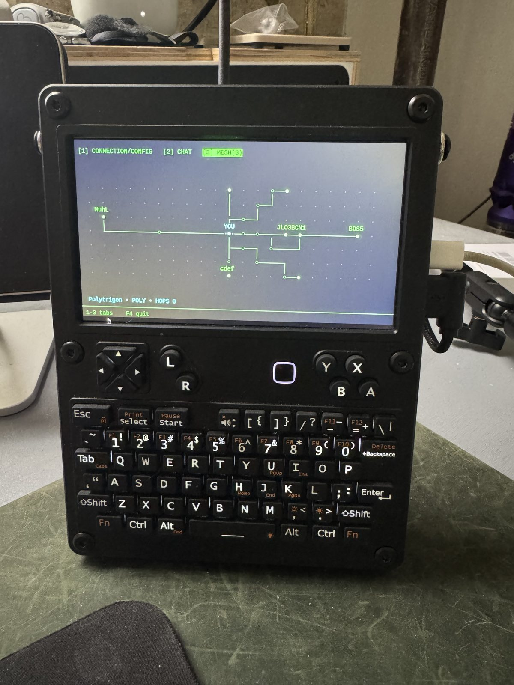
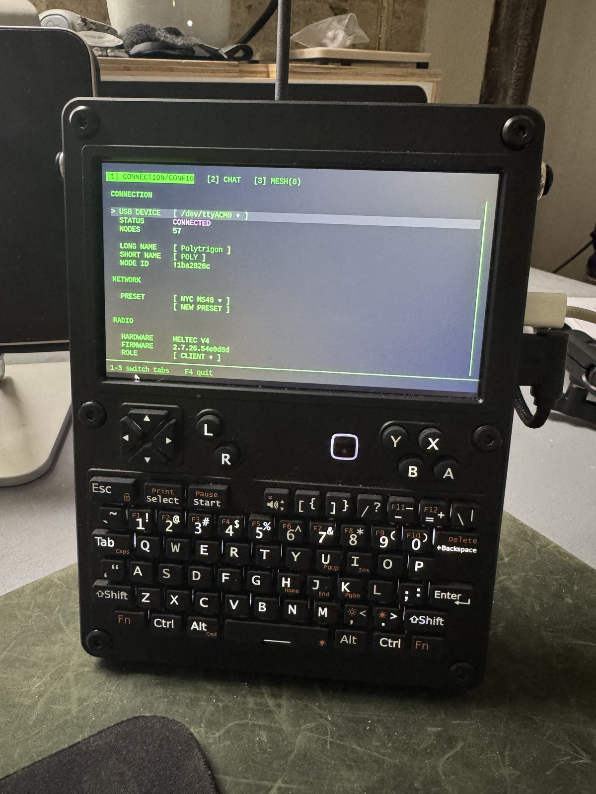
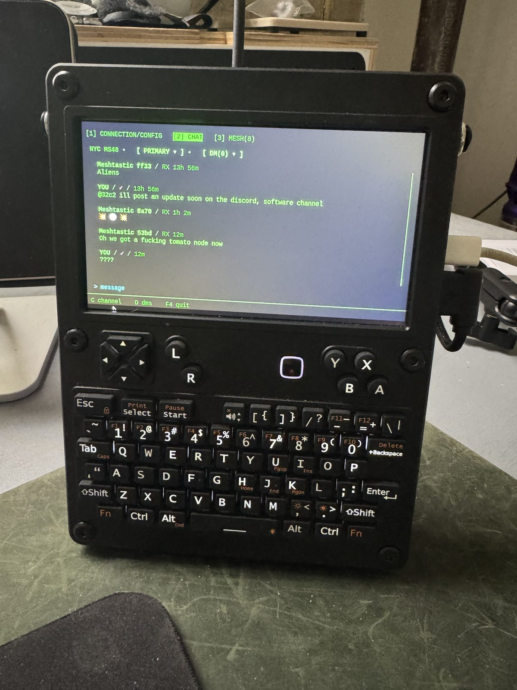

# MeshtasticPass - A Custom uConsole Meshtastic Chat Client

This project began because I was having a difficult time finding a custom
meshtastic chat client that matched the aesthetic of the Clockwork uConsole.
So at its core it's a simple chat client that should handle the majority of
functions that are necessary to communicate on the meshtastic network. However
the ultimate goal is to build an extra layer on top of meshtastic that enables
the sharing of profiles through proximity, similar to the [Nintendo 3DS StreetPass
system](https://www.nintendo.com/en-gb/Hardware/Nintendo-3DS-Family/StreetPass/What-is-StreetPass-/What-is-StreetPass-827701.html).

Plug a Meshtastic ESP32 radio into a uConsole over USB and MeshtasticPass gives
you channel chat, direct messages, persistent local history, delivery-state
feedback, and a passive map of the mesh around you -- all in a terminal UI
driven entirely from the keyboard, with no mouse and no touchscreen required.



**This is early-stage software and is being shared for testing.** Expect rough
edges, and see [Known limitations](#known-limitations) before you file anything.
MeshtasticPass is an independent project, not affiliated with or endorsed by
Meshtastic.

## MeshtasticPass Philosophy

MeshtasticPass isn't intended to be the end all be all most productive meshtastic
chat client, for this reason the mesh view isn't your typical geographic-centric
representation of the mesh. This is the root of the app's philosophy. Give you
just as much information as required. As mentioned above the ultimate goal of
this app isn't to just be another chat client, it's to eventually enable peer
to peer sharing of profiles on the meshtastic network through discrete packets.

---

## Try it without a radio

You do not need hardware to see the whole application. A deterministic simulator
stands in for the radio, complete with fake nodes, scripted incoming messages,
and activity that ages while you watch.

```bash
git clone https://github.com/polytrigon/MeshtasticPass.git
cd MeshtasticPass
python3 -m venv .venv
source .venv/bin/activate
python -m pip install --upgrade pip
python -m pip install -r requirements.txt
python app.py --simulate
```

This is the fastest way to get a feel for the app, and the best way to report a
UI bug -- the simulator is deterministic, so anything you see, I can reproduce.

## Run it with a radio

**You need:** a Linux machine with a terminal (the uConsole is the target, but
any Linux box works), a Meshtastic ESP32 radio, and a USB cable.

With the virtual environment active:

```bash
python app.py
```

`/dev/ttyUSB0` is the default. Pick a different device from the CONNECTION page,
or override it for one run:

```bash
python app.py --device /dev/ttyACM0
```

If Linux can see the device but Python reports permission denied, add yourself to
the serial group and log out and back in:

```bash
sudo usermod -aG dialout "$USER"
```

### uConsole menu launcher

On a uConsole, `./install-launcher.sh` adds a desktop entry that starts
MeshtasticPass fullscreen in its own terminal profile. It does not change your
global terminal settings -- it writes a dedicated LXTerminal profile and a
marker-delimited block in the labwc config, both listed in [PRIVACY.md](PRIVACY.md).

## Getting around

Everything is keyboard-driven. There is no mouse requirement anywhere.

| Key | Does |
| --- | --- |
| `1` `2` `3` `4` | CONNECTION/CONFIG, CHAT, PASSES, MESH |
| `C` | Channel dropdown (in CHAT, outside the input) |
| `S` | Sort order (in PASSES) |
| `Escape` | Leave the composer and navigate the transcript |
| `Up` / `Down` | Move one message or control at a time |
| `Right` | Jump to the newest message |
| `Enter` | Open the menu for the node under the cursor |
| `F4` | Quit from anywhere |

Note that `q` is ordinary text, not a quit key -- you can type it in a message
without the app closing. Direct messages are a mode inside CHAT rather than a
separate tab, reached from the header's DM peer selector.



**CONNECTION/CONFIG** is the radio connection, device selection, your identity,
channel management, and appearance settings (SNOW, AMBER and MATRIX themes,
UI scale).



**CHAT** is the currently selected broadcast channel, with persistent history,
per-message delivery state, and unread tracking. History survives restarts.

**PASSES** is every node this radio has ever encountered, laid out like an
MS-DOS `dir /w` listing. It is a record rather than a live view: a node stays
listed long after it has aged out of the radio's own node database and off the
MESH board, and the list is just as valid with no radio attached. Sort it by
name, hop count or recency with `S`; `Enter` on a name opens the same node menu
CHAT's sender names do.

Duplicate names are shown as duplicates, because a mesh full of repeated short
names is the normal state and two radios sharing one emoji really are two
radios. The bar under the grid names the node ID of whichever cell is
highlighted, which is what tells them apart.

The header reads `N NODES · M PASSES`. NODES is everyone encountered; PASSES is
the subset that has exchanged a pass with you, which only another
MeshtasticPass install can do. That number is zero today and will stay zero
until the exchange exists -- it is deliberately not a rename of "nodes I have
heard directly", which is a fact about radio range rather than about having met
anyone.

**MESH** is a passive, YOU-centred board of the nodes around you. It never
transmits to build itself -- everything on it comes from the radio's own node
database and packets that arrived anyway.

Nodes sit on rings by hop depth rather than by distance, because most nodes
never report a position and distance-first placement put all of them on one
shared fallback ring. Rings are ranked over the depths actually present, so a
mesh whose nodes are 0, 4, 5 and 6 hops away uses four rings rather than
leaving three empty ones in the middle; the innermost ring is reserved for
direct neighbours, so "next to YOU" always means no intermediary. A connector
carries one marker per ring it crosses -- not one per hop, which is why a
6-hop node may show three. Nodes dim as they go stale. TRACE ROUTE is the one
thing on this board that transmits, and only when you ask it to.

## What I would like tested

1. **Does it connect?** Different radios, different USB devices, different
   Linux distributions. The connection path has only been exercised on a
   uConsole with a USB-attached ESP32.

   **If you have a HackerGadgets AIO board**, start `meshtasticd` as its
   setup guide describes, then open CONNECTION/CONFIG: the RADIO list
   should offer `meshtasticd (localhost:4403)` alongside any serial
   devices. Picking it should connect, populate the identity and radio
   rows, and let CHAT and MESH work normally. Tell me what happens either
   way -- a failure here is more useful to me right now than a success
   anywhere else.
2. **Unplug the radio mid-session,** then plug it back in. It should reconnect on
   its own and keep working.
3. **Send and receive on a real mesh.** Delivery states, ordering when packets
   arrive late, and whether history is intact after a restart.
4. **The MESH board with more than a handful of nodes.** It has mostly been seen
   with about eight, and layout is where I expect problems.
5. **PASSES with a few hundred nodes.** Column layout, scrolling, and whether
   the sort orders do what you expect.
6. **Anything that looks visually wrong** -- misaligned labels, colours that
   don't match the rest of the UI, text that overflows.

   Emoji in node names were the long-standing source of this, and the cause is
   now understood: a terminal with no glyph for an emoji falls back to a text
   font and advances ONE column where the layout accounted for two, so
   everything after it on that line slides. The app measures your terminal at
   startup and corrects for it -- and corrects Rich's own measurements too, so
   wrapping and the CHAT scrollbar follow. If anything still looks misaligned,
   run `.venv/bin/python terminal_width_probe.py` **in the uConsole's own
   terminal, not over SSH** -- over SSH it measures the machine you connected
   from -- and include the output in the report. It names the exact glyphs your
   font disagrees about and the corrections the app applied.

## Known limitations

- **AIO / meshtasticd support is new and untested on real hardware.**
  MeshtasticPass can now connect over TCP to a `meshtasticd` daemon as well
  as to a USB serial radio, which is what a HackerGadgets uConsole AIO
  board needs -- its SX1262 hangs off the Pi's SPI and has no serial port.
  The parsing and discovery around it are unit-tested, but no one has yet
  confirmed an actual connection to an AIO board. If you have one, this is
  the single most useful thing you can try.
- Tested on one hardware combination: ClockworkPi uConsole plus a Meshtastic
  ESP32.
- Some tests in `tests/test_mesh_topology.py` fail. They are known, and none of
  them is caused by your setup. They fall into two groups.

  Most still assert the old "one marker per hop" rule that the hop-ring layout
  replaced -- markers now count RINGS crossed. Those are being updated one at a
  time, against each fixture's own depths rather than by copying whatever the
  code currently emits, so an expectation cannot be quietly fitted to a bug.

  The rest are open questions rather than stale expectations: whether a node
  showing the TRACE ROUTE star should still draw anonymous hop markers; why a
  GPS update no longer reflows placement; arrow navigation landing on a
  different node than it used to; and one traceroute label lookup that raises.

- `test_you_and_remote_selection_yield_identical_logical_graph` can fail
  intermittently. It drives the board by hand while the app's own 1s refresh is
  running and sometimes loses that race. A re-run usually passes.

## Reporting problems

Open an issue with your hardware, your Linux distribution, and what you did.
If you can reproduce it under `--simulate`, say so and include the steps -- those
reports are the most actionable, because the simulator is deterministic.

For anything security-sensitive, follow [SECURITY.md](SECURITY.md) and report
privately instead of opening an issue.

## Your data stays on your machine

MeshtasticPass has no accounts, no telemetry, and no network calls beyond the
radio itself. Settings live under `${XDG_CONFIG_HOME:-$HOME/.config}` and chat
history under `${XDG_DATA_HOME:-$HOME/.local/share}`.
[PRIVACY.md](PRIVACY.md) lists every path and exactly what is in it.

## Development

```bash
.venv/bin/python -m unittest discover
```

**Quit MeshtasticPass before running the tests.** The radio talks to one
application at a time, so a running instance holds the serial port and the suite
comes back as a wall of errors that look like real failures.

Run the tests from the virtual environment, not system Python -- a bare
`python -m unittest discover` silently loads a fraction of the suite and reports
missing-dependency errors as failures.

- [CONTRIBUTING.md](CONTRIBUTING.md) -- before preparing a change
- [AGENTS.md](AGENTS.md) -- conventions this codebase holds itself to
- [devJournal.md](devJournal.md) -- the original milestone-by-milestone
  development log, kept as the detailed record of how each part was built and
  verified

UI code should call `RadioService`; it should not import or manage the Meshtastic
SDK directly.
